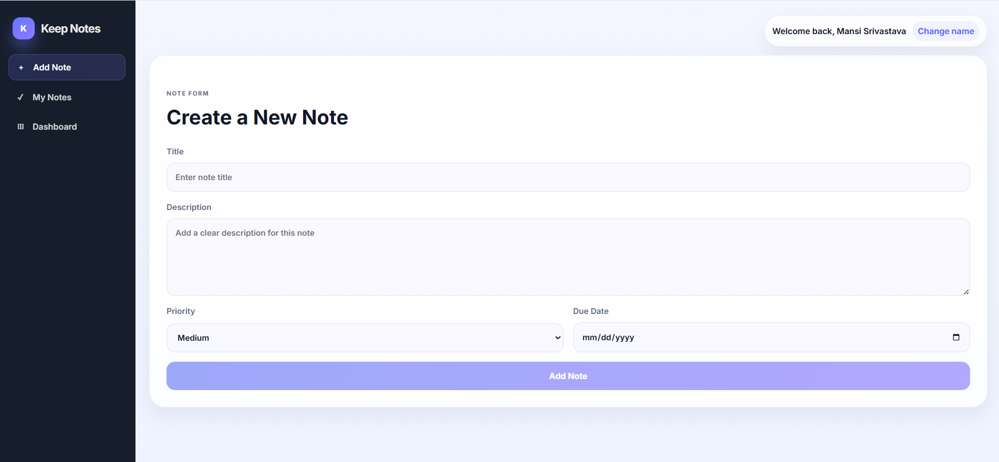
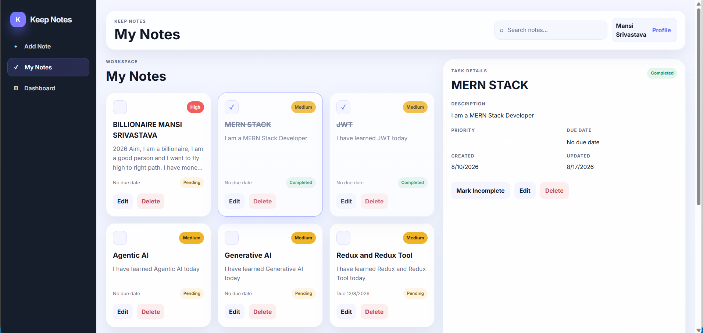
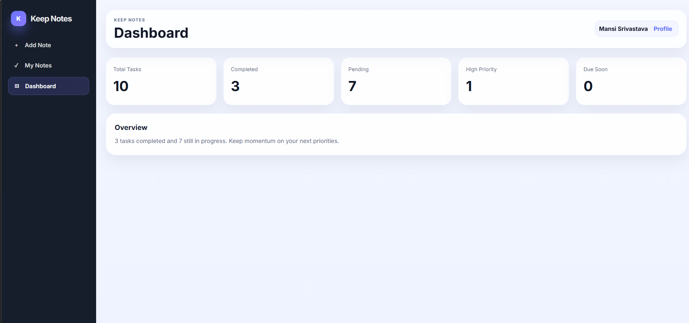

# Keep Notes

Keep Notes is a full-stack note management application built with the MERN stack. It provides a clean and professional interface for creating, managing, and organizing notes with persistent data storage.

## Features

- Create, edit, and delete notes
- Mark notes as completed or pending
- Set priority and due dates
- Search notes
- View detailed note information
- Dashboard with note statistics
- Personalized user name using Local Storage
- Responsive and professional UI
- RESTful API integration
- MongoDB data persistence

## Project Preview

### Create Note

### My Notes

### Dashboard

## Tech Stack

**Frontend**
- React.js
- Vite
- JavaScript
- CSS3
- Fetch API

**Backend**
- Node.js
- Express.js
- MongoDB
- Mongoose

**Tools**
- Git
- GitHub
- VS Code
- Postman

## Project Structure

    TODO-BACKEND/
    ├── backend/
    │   ├── config/
    │   ├── controllers/
    │   ├── middleware/
    │   ├── models/
    │   ├── routes/
    │   └── server.js
    │
    ├── frontend/
    │   └── src/
    │       ├── api/
    │       ├── components/
    │       ├── App.jsx
    │       └── main.jsx
    │
    └── README.md

## API Endpoints

| Method | Endpoint | Description |
|--------|----------|-------------|
| GET | /api/todos | Get all notes |
| GET | /api/todos/:id | Get a note by ID |
| POST | /api/todos/create | Create a new note |
| PUT | /api/todos/:id | Update a note |
| PATCH | /api/todos/:id/toggle | Toggle completion status |
| DELETE | /api/todos/:id | Delete a note |

## Getting Started

### Prerequisites

- Node.js
- MongoDB
- Git

### Clone the Repository

    git clone https://github.com/Mansi-Srivastava11/ToDo_website.git
    cd ToDo_website

### Backend Setup

    cd backend
    npm install

Create a `.env` file inside the `backend` folder:

    MONGO_URI=mongodb://localhost:27017/todo_db
    PORT=3001

Start the backend server:

    npm run dev

### Frontend Setup

Open a new terminal:

    cd frontend
    npm install

Create a `.env` file inside the `frontend` folder:

    VITE_API_URL=http://localhost:3001

Start the frontend:

    npm run dev

Make sure MongoDB is running before using the application.

## Key Concepts

- React component-based architecture
- React Hooks and state management
- REST API integration
- Express.js routing and middleware
- MongoDB CRUD operations with Mongoose
- Form handling and validation
- Error handling
- Local Storage
- Responsive UI development

## Author

**Mansi Srivastava**

MERN Stack Developer

GitHub: https://github.com/Mansi-Srivastava11

---

⭐ If you like this project, consider giving it a star on GitHub.